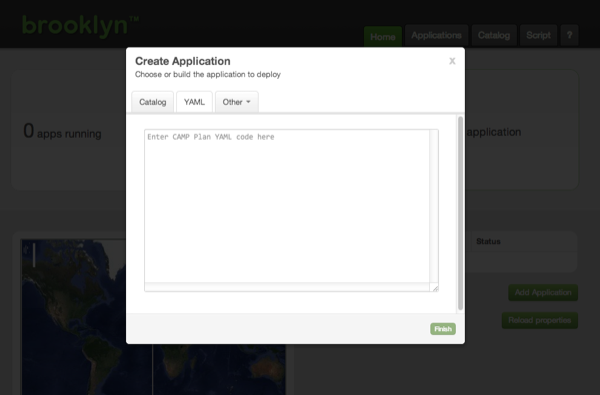
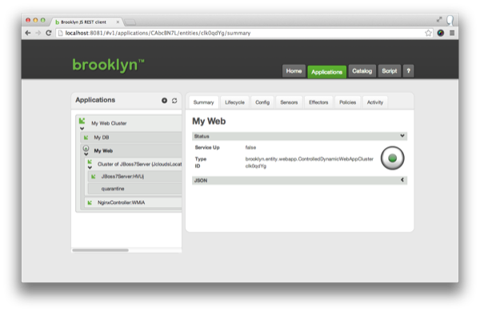
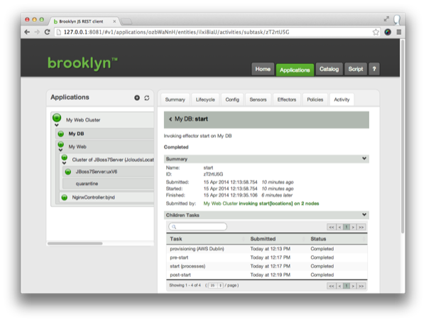

This guide will walk you through deploying an application to a public cloud.

We will be deploying an example 3-tier web application, described using this blueprint: 





(This is written in YAML, following the [camp specification](https://www.oasis-open.org/committees/camp/). )

## Install Brooklyn

Download the [Brooklyn distribution]({{ site.data.brooklyn.url.dist.tgz }}) and expand it to your home directory ( `~/` ), or in a location of your choice. (Other [download options]({{site.url}}/download.html) are available.)


Expand the `tar.gz` archive (note: as this is a -SNAPSHOT version, your filename will be slightly different):

Expand the `tar.gz` archive:




$ tar -zxf brooklyn-dist-{{ site.data.brooklyn.version }}-timestamp-dist.tar.gz



$ tar -zxf brooklyn-dist-{{ site.data.brooklyn.version }}-dist.tar.gz



This will create a `brooklyn-{{ site.data.brooklyn.version }}` folder.

Note: You'll need a Java JRE or SDK installed (version 6 or later), as Brooklyn is Java under the covers.

## Launch Brooklyn

Let's setup some paths for easy commands.

(Click the clipboard on these code snippets for easier c&p.)


$ cd brooklyn-{{ site.data.brooklyn.version }}
$ BROOKLYN_DIR="$(pwd)"
$ export PATH=$PATH:$BROOKLYN_DIR/bin/


We can do a quick test drive by launching Brooklyn:


$ brooklyn launch


Brooklyn will output the address of the management interface:

`INFO  Starting brooklyn web-console on loopback interface because no security config is set`

`INFO  Started Brooklyn console at http://127.0.0.1:8081/, running classpath://brooklyn.war and []`

But before we really use Brooklyn, we need to setup some Locations.
 
Stop Brooklyn with ctrl-c.

## Configuring a Location

Brooklyn deploys applications to Locations.

Locations can be clouds, machines with fixed IPs or localhost (for testing).

Brooklyn loads Location configuration  from `~/.brooklyn/brooklyn.properties`. 

Create a `.brooklyn` folder in your home directory and download the template [brooklyn.properties](brooklyn.properties) to that folder.


$ mkdir ~/.brooklyn
$ cd ~/.brooklyn
$ wget {{site.url}}/quickstart/brooklyn.properties


Open brooklyn.properties in a text editor and add your cloud credentials.

If you would rather test Brooklyn on localhost, follow [these instructions]({{ site.data.brooklyn.url.userguide }}/use/guide/locations/) to ensure that your Brooklyn can access your machine.

Restart Brooklyn:


$ brooklyn launch


## Launching an Application

There are several ways to deploy a YAML blueprint (including specifying the blueprint on the command line or submitting it via the REST API).

For now, we will simply copy-and-paste the raw YAML blueprint into the web console.

Open the web console ([127.0.0.1:8081](http://127.0.0.1:8081)). As Brooklyn is not currently managing any applications the 'Create Application' dialog opens automatically. Select the YAML tab.

### Chose your Cloud / Location

Edit the 'location' parameter in the YAML template (repeated below) to use the location you configured.

For example, replace:

location: location


with (one of):

location: aws-ec2:us-east-1
location: rackspace-cloudservers-us:ORD
location: google-compute-engine:europe-west1-a
location: localhost


**My Web Cluster Blueprint**





Paste the modified YAML into the dialog and click 'Finish'.
The dialog will close and Brooklyn will begin deploying your application.

Your application will be shown as 'Starting' on the web console's front page.

## Monitoring and Managing Applications

Click on the application name, or open the Applications tab.

We can explore the management hierarchy of the application, which will show us the entities it is composed of.

 * My Web Cluster (A `BasicApplication`)
     * My DB (A `MySqlNode`)
     * My Web (A `ControlledDynamicWebAppCluster`)
        * Cluster of JBoss7 Servers (A `DynamicWebAppCluster`)
        * NginxController (An `NginxController`)

Clicking on the 'My Web' entity will show the Summary tab. Here we can see if the cluster is ready to serve and, when ready, grab the web address for the front of the loadbalancer.

The Activity tab allows us to drill down into what activities each entity is currently doing or has recently done. It is possible to drill down to all child tasks, and view the commands issued, and any errors or warnings that occured.

Drill into the 'My DB' start operation. Working down through  'Start (processes)', then 'launch', we can discover the ssh command used including the stdin, stdout and stderr.

## Stopping the Application

To stop an application, select the application in the tree view (the top/root entity), click on the Effectors tab, and invoke the 'Stop' effector. This will cleanly shutdown all components in the application and return any cloud machines that were being used.

### Next 

So far we have touched on Brooklyn's ability to *deploy* an application blueprint to a cloud provider, but this a very small part of Brooklyn's capabilities!

Brooklyn's real power is in using Policies to automatically *manage* applications. There is also the (very useful) ability to store a catalog of application blueprints, ready to go.

[Getting Started - Policies and Catalogs](policies-and-catalogs.html)
